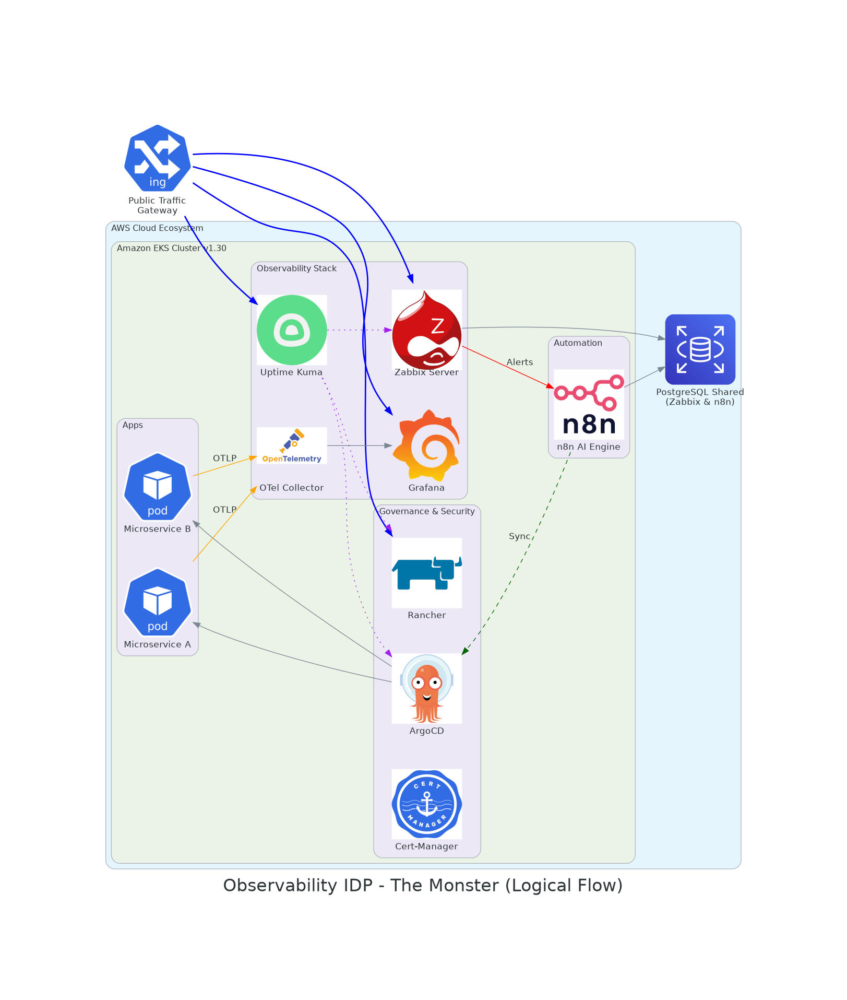

# 🚀 Observability IDP "The Monster" (Local-First Edition)

> **Status:** Framework de Observabilidade Inteligente e AIOps 🤖

## 📄 Visão Geral
Este projeto é uma **IDP (Internal Developer Platform)** de Observabilidade desenhada para substituir soluções SaaS de alto custo como **Datadog** e **Dynatrace**. A plataforma utiliza o padrão **OpenTelemetry** para evitar o aprisionamento tecnológico (*Vendor Lock-in*) e integra **IA Generativa** para automação de resposta a incidentes.

## ⚖️ O Desafio do Mercado: SaaS vs. Soberania
Empresas modernas utilizam Datadog/Dynatrace pela facilidade de correlacionar métricas, logs e traces. No entanto, o custo por "host" e a falta de controle sobre os dados tornam-se gargalos financeiros (FinOps). 

**"The Monster" resolve isso unindo o melhor do Open Source:**
*   **Zabbix:** Monitoramento de infraestrutura crítica e ativos.
*   **OpenTelemetry:** Coleta padronizada de APM e Tracing (Sem agentes proprietários).
*   **n8n + Groq (Llama 3.3):** Cérebro de AIOps que analisa alertas e sugere correções via IA.
*   **Grafana:** Centralização visual de métricas, logs e traces.

---

## 🏗️ Arquitetura da Solução
Abaixo, a comparação entre o modelo SaaS tradicional e a nossa arquitetura soberana:

### 1. Modelo SaaS (Datadog/Dynatrace)
Neste modelo, agentes proprietários enviam dados para nuvens externas, gerando custos variáveis e riscos de conformidade.

### 2. Modelo "The Monster" (Nossa Implementação)
Focada em rodar dentro da infraestrutura do cliente (AWS ou Local) com custos previsíveis.

---

## 🛠️ Stack Tecnológica (Local Cluster)
| Componente | Função |
| :--- | :--- |
| **K3d / K3s** | Orquestração Kubernetes Local (Custo Zero) |
| **Argo CD** | Entrega Contínua via GitOps |
| **Zabbix** | Motor de Monitoramento Tradicional |
| **n8n + Groq** | Engine de Automação com Inteligência Artificial |
| **PostgreSQL** | Persistência de Dados Unificada |
| **Ingress-Nginx** | Gateway de Tráfego com DNS sslip.io |

---

## 🤖 Diferencial: AIOps em Ação
A plataforma não apenas monitora, ela **entende**. Quando um incidente ocorre:
1.  **Zabbix** detecta a falha e dispara um Webhook.
2.  **n8n** recebe o alerta e consulta o **AI Agent (Groq)**.
3.  A IA analisa o contexto (memória, logs, histórico) e envia um diagnóstico pronto: *"O Pod 'X' está com OOMKilled devido ao limite de RAM. Deseja escalar? [SIM/NÃO]"*.

---

## 🚀 Como testar (Local)
1.  Possuir Docker e WSL2 instalados.
2.  Rodar `k3d cluster create --config infra-local/cluster-config.yaml`.
3.  Configurar a API Key do Groq no n8n.
4.  Realizar o Bootstrap via `kubectl apply -f kubernetes/bootstrap/root-app.yaml`.

---

## 👤 Autor
**Felipe Carpanezi**  
*Cloud Architect & Platform Engineer*
[LinkedIn](https://www.linkedin.com/in/felipe-carpanezi-b5440334/) | [GitHub](https://github.com/Felipe-carpanezi)