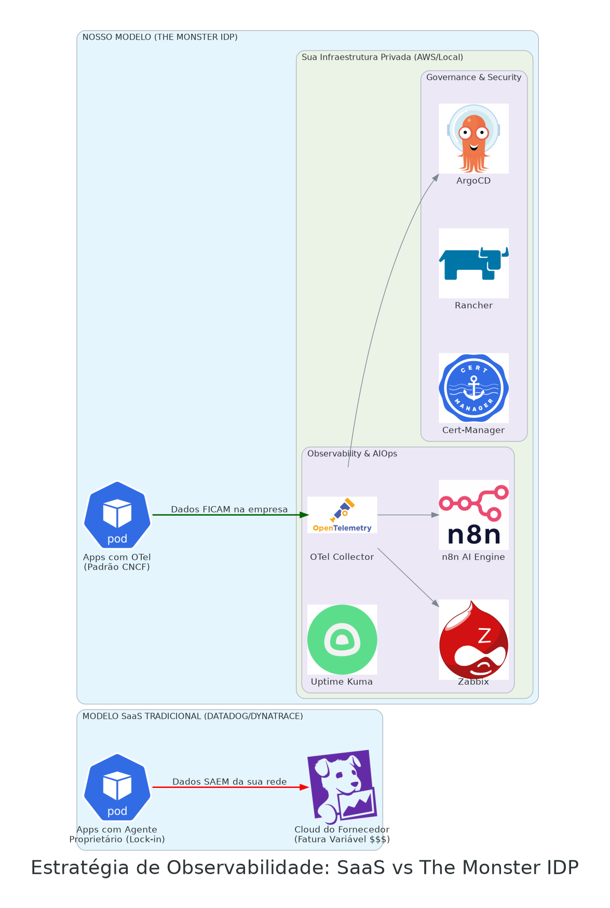

# 🚀 Observability IDP "The Monster" (Enterprise Edition)

> **Status do Projeto:** Framework de Observabilidade Inteligente e AIOps 🤖

Este repositório contém a implementação de uma **Internal Developer Platform (IDP)** focada em observabilidade de alta performance e automação de resposta a incidentes. O projeto foi desenhado como uma alternativa soberana, agnóstica e de custo fixo a soluções SaaS de alto valor como **Datadog** e **Dynatrace**.

---

## ⚖️ Estratégia de Mercado: SaaS vs. Soberania de Dados

No modelo tradicional (SaaS), as empresas pagam "impostos sobre o crescimento", onde cada novo host ou microserviço aumenta a fatura de forma imprevisível. Além disso, os dados sensíveis de performance saem da rede da empresa.

**"The Monster" inverte essa lógica:**

### Diferenciais desta Arquitetura:
1.  **OpenTelemetry (CNCF):** Padronização total de métricas e traces sem a necessidade de agentes proprietários.
2.  **Soberania de Dados:** Logs e métricas armazenados internamente, garantindo conformidade com a LGPD.
3.  **Custo Otimizado:** Utilização de infraestrutura própria (AWS ou Local) com previsibilidade financeira total.

---

## 🏗️ Arquitetura Lógica do Cluster
A plataforma organiza as ferramentas de governança, segurança e monitoramento em camadas isoladas via Namespaces.

---

## 🛠️ Stack Tecnológica Completa

| Camada | Componente | Função |
| :--- | :--- | :--- |
| **Orquestração** | **K3d / K3s** | Kubernetes Local de alta performance (Custo Zero) |
| **GitOps** | **Argo CD** | Sincronização contínua entre o Git e o Cluster |
| **Gestão** | **Rancher Manager** | Interface visual para governança e controle de recursos |
| **Monitoramento** | **Zabbix** | Motor de coleta de infraestrutura e ativos de rede |
| **APM / Tracing** | **OpenTelemetry** | Coleta padronizada de telemetria (Padrão CNCF) |
| **Automação** | **n8n + Groq IA** | Cérebro de AIOps para análise e correção de incidentes |
| **Disponibilidade**| **Uptime Kuma** | Monitoramento de disponibilidade externa e Watchdog |
| **Visualização** | **Grafana** | Dashboards unificados (Single Pane of Glass) |
| **Segurança** | **Cert-Manager** | Gestão automática de certificados TLS/SSL |
| **Persistência** | **PostgreSQL** | Banco de dados unificado para Zabbix e n8n |
| **Rede** | **Ingress-Nginx** | Gateway de tráfego com resolução DNS sslip.io |

---

## 🤖 O Diferencial: AIOps (Inteligência Operacional)
Diferente dos alertas comuns, esta plataforma utiliza um **AI Agent (Llama 3.3 via Groq)** integrado ao n8n para:
*   **Triagem Automática:** Interpretação de erros técnicos em linguagem de negócio.
*   **Self-Healing:** Sugestão ou execução de comandos de correção imediata.
*   **Escalonamento Inteligente:** Notificação via WhatsApp/Slack já com o diagnóstico mastigado.

---

## 💰 Governança Financeira (FinOps)
O projeto integra o **Infracost** para prever custos de nuvem. Em cenários AWS, o uso de Kubernetes v1.30 gera uma economia de **$438.00 mensais** em comparação a versões legadas, provando que a arquitetura bem gerida se paga através da manutenção preventiva.

---

## 🚀 Como este ambiente é implantado (Local)
1.  **Infra:** `k3d cluster create --config infra-local/cluster-config.yaml`
2.  **Bootstrap:** Instale o Argo CD via Helm.
3.  **GitOps:** Aplique o `kubectl apply -f kubernetes/bootstrap/root-app.yaml`.
4.  **Ready:** O Argo CD provisionará toda a stack automaticamente.

---

## 👤 Autor

**Felipe Carpanezi**  
*Cloud Architect & Platform Engineer*

*   [LinkedIn](https://www.linkedin.com/in/felipe-carpanezi-b5440334/)
*   [GitHub](https://github.com/Felipe-carpanezi)